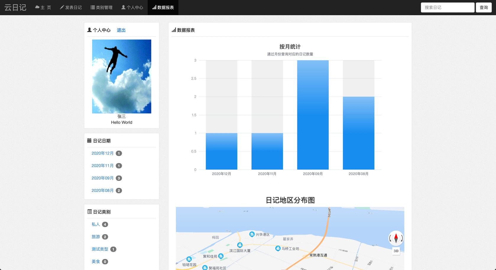

## 项目介绍

  

基于JavaServlet开发的个人云日记项目

### 演示地址

项目地址：[http://101.201.232.79:8080/login.jsp](http://101.201.232.79:8080/login.jsp)  
账号：admin，密码：123456  
（由于域名用于个人博客项目，当前项目没有使用域名，当前项目仅使用IP地址进行访问）

### 技术介绍

前端：Layui + BootStrap + JSP  
后端：Maven + Servlet + MySQL + Tomcat + Docker + Log4j  
其他：Echarts + 百度地图API + UEditor

### 开发环境

| 开发工具 | 功能作用 |  
| -- | -- |  
| Idea | Java开发工具 |  
| Navicat | MySQL操作工具 |  
| MobaXterm | 连接服务器和文件上传工具 |

| 开发环境 | 版本 |  
| -- | -- |  
| Java | 1.8 |  
| MySQL | 8.0.13 |  
| Tomcat | 8.5.57 |  


### 运行环境
服务器：阿里云轻量级1核2G服务器（Centos7.2）

### 目录结构
```shell
cloud-diary
├── controller  -- 控制器模块
├── service     -- 业务处理模块
├── filter      -- 拦截器模块
├── pojo        -- Java对象模块
├── util        -- 工具类模块
└── vo          -- vo模块    
```

### 项目截图





### 快速开始
Docker环境安装：[https://www.zrkizzy.com/archives/docker-install](https://www.zrkizzy.com/archives/docker-install)  
Docker部署配置：  
在服务器中安装好Docker和Docker-compose后即可进行接下来的操作  


### 项目总结
当前个人日记项目基于JavaWeb开发，所涉及到的技术栈不是特别广，比较适合还没有学习到框架的同学作为入门项目进行学习，对于已经学习完SSM框架的同学进行框架为我们封装的技术再次进行回顾，加深对于SSM的理解。同时也可以锻炼自己脱离了框架以后可以做什么的能力。