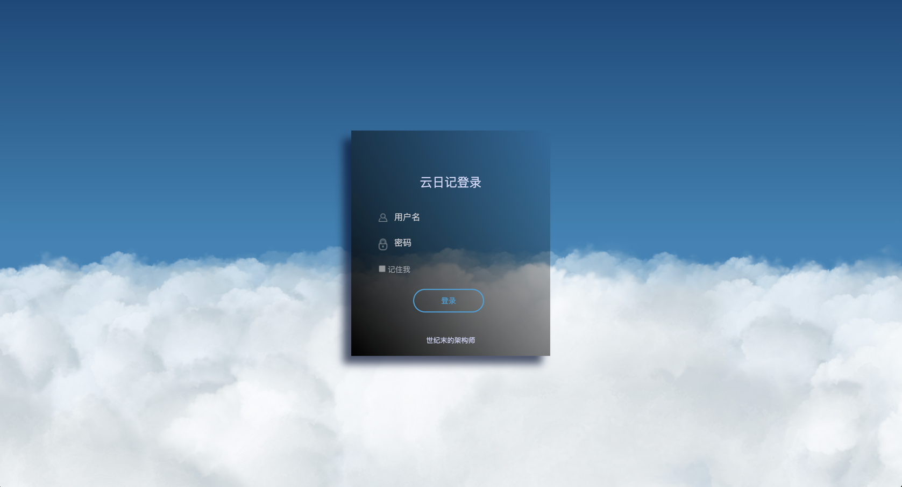

## 项目介绍

  

基于JavaServlet开发的个人云日记项目

### 演示地址

项目地址：[http://101.201.232.79:8080/login.jsp](http://101.201.232.79:8080/login.jsp)  
账号：admin，密码：123456  
（由于域名用于个人博客项目，当前项目没有使用域名，当前项目仅使用IP地址进行访问）

### 技术介绍

前端：Layui + BootStrap + JSP  
后端：Maven + Servlet + MySQL + Tomcat + Docker + Log4j  
其他：Echarts + 百度地图API + UEditor

### 开发环境

| 开发工具 | 功能作用 |  
| -- | -- |  
| Idea | Java开发工具 |  
| Navicat | MySQL操作工具 |  
| MobaXterm | 连接服务器和文件上传工具 |

| 开发环境 | 版本 |  
| -- | -- |  
| Java | 1.8 |  
| MySQL | 8.0.13 |  
| Tomcat | 8.5.57 |  


### 运行环境
服务器：阿里云轻量级1核2G服务器（Centos7.2）

### 目录结构
```shell
cloud-diary
├── controller  -- 控制器模块
├── service     -- 业务处理模块
├── filter      -- 拦截器模块
├── pojo        -- Java对象模块
├── util        -- 工具类模块
└── vo          -- vo模块    
```

### 项目截图



### 快速开始
Docker环境安装：[https://www.zrkizzy.com/archives/docker-install](https://www.zrkizzy.com/archives/docker-install)  
Docker部署配置：  
**服务器中安装好Docker和Docker-compose后即可进行接下来的操作**
- 在服务器中输入```su```命令并输入密码后切换到root用户
- 输入命令```cd home```跳转到home目录下
- 输入命令```mkdir cloud-diary```创建项目运行的目录
- 跳转到项目运行根目录```cd cloud-diary```
- 此时将项目文件中的```doc/docker```目录下的```docker-compose.yml```文件传输到服务器当前位置
- 执行命令```mkdir mysql-init```命令创建MySQL初始化目录
- 执行命令```cd mysql-init```跳转到MySQL初始化目录并将项目中的```doc/sql```目录下的mydiary.sql文件传输到服务器当前位置
- 执行命令```cd ../```退出MySQL初始化目录，输入命令```mkdir webapps```命令创建存放项目war包的目录
- 进入到webapps目录中```cd webapps```，将项目文件中的```doc/war```目录下的ROOT.war文件添加到服务器当前位置后执行```cd ../```命令返回上一级目录
- 执行命令```docker-compose up```命令即可启动项目
- 项目启动后，在浏览器中输入```http://服务器公网IP:8080/login.jsp```即可访问项目
- 初始用户名admin，初始密码：123456


### 项目总结
当前个人日记项目基于JavaWeb开发，所涉及到的技术栈不是特别广，比较适合还没有学习到框架的同学作为入门项目进行学习，对于已经学习完SSM框架的同学进行框架为我们封装的技术再次进行回顾，加深对于SSM的理解。同时也可以锻炼自己脱离了框架以后可以做什么的能力。